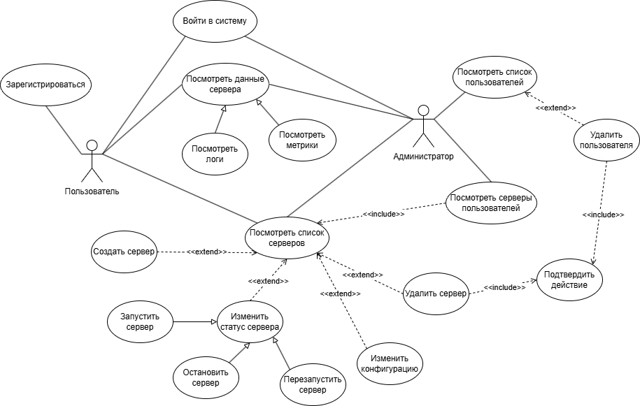
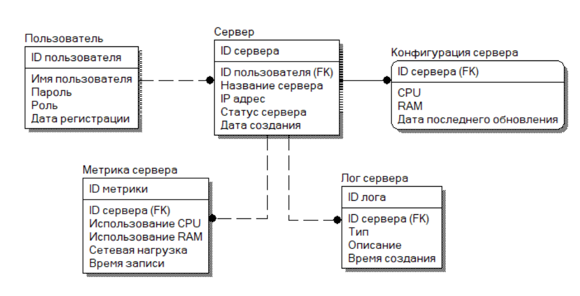
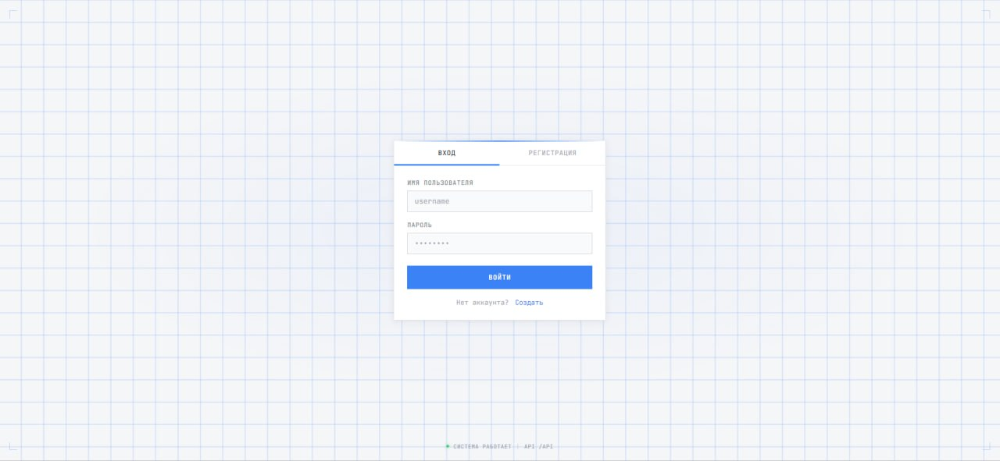
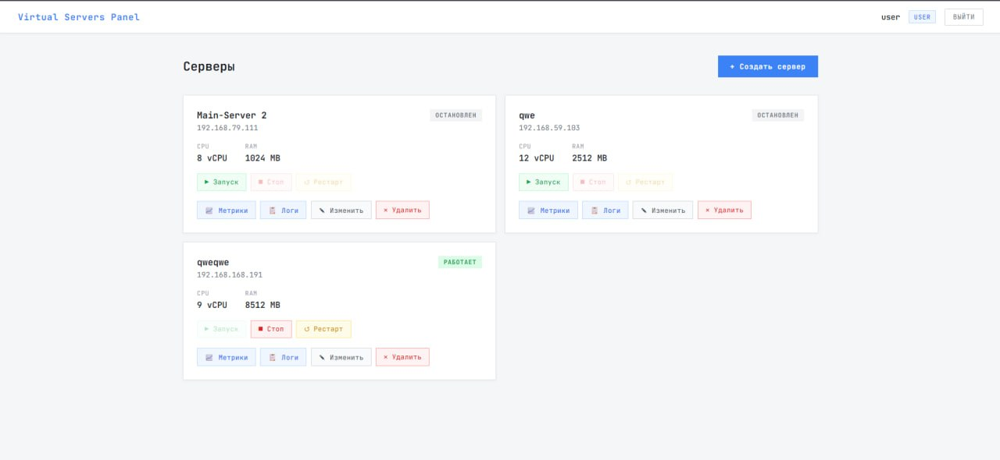
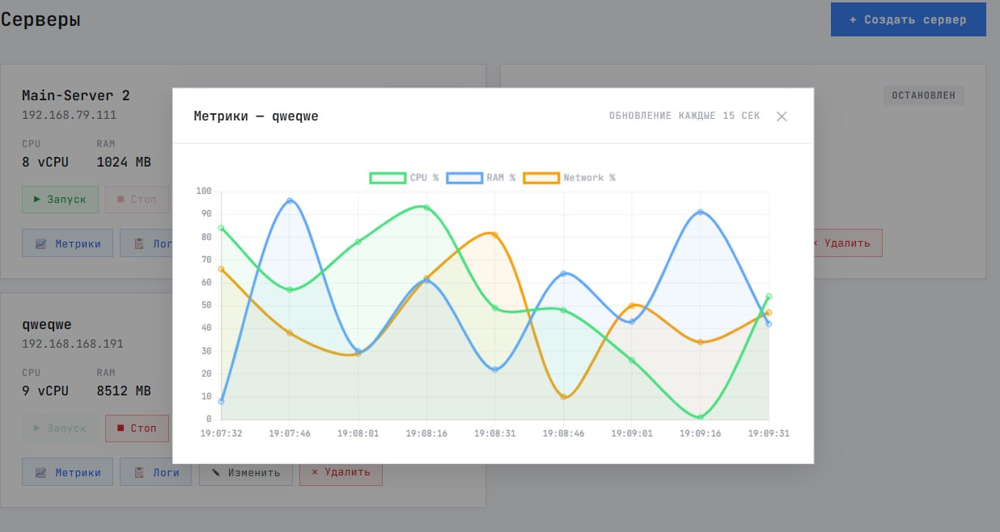
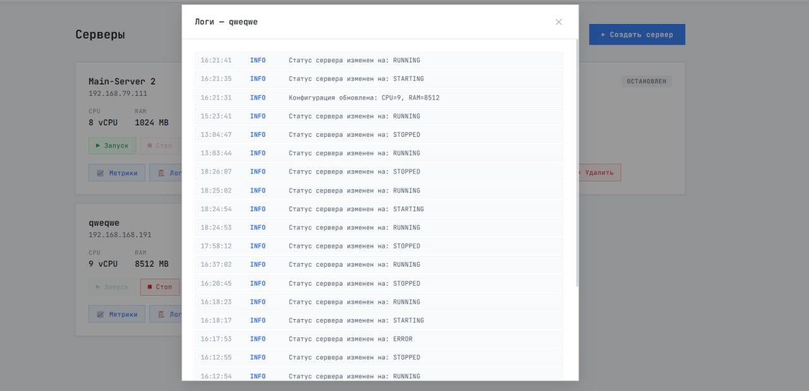
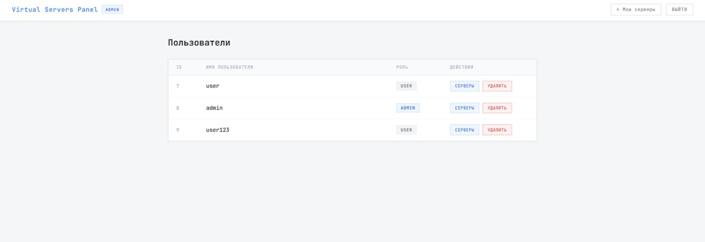
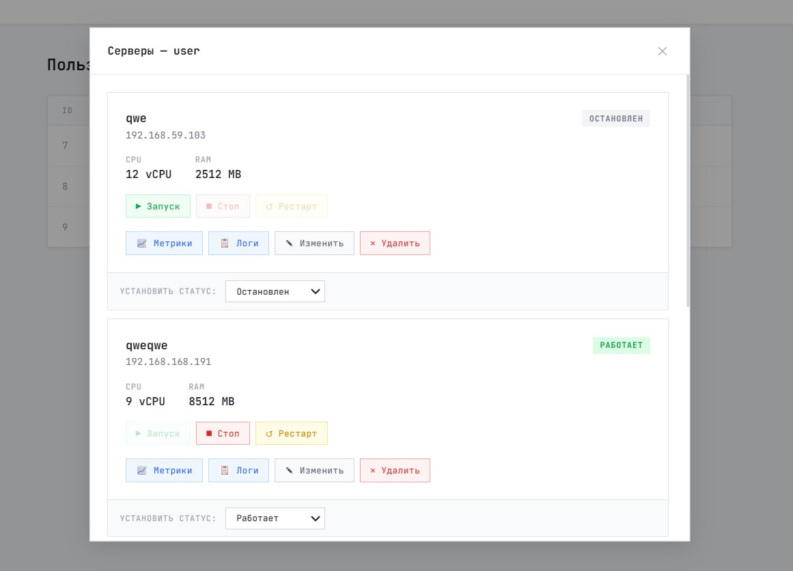

# Virtual Servers Management Simulation

Автоматизированная информационная система управления виртуальными серверами.

Проект демонстрирует реализацию веб-приложения для управления жизненным циклом виртуальных серверов. Создание серверов, изменение их состояния, просмотр системных метрик и журналов событий выполняются **в рамках программной модели**, без взаимодействия с реальными средствами виртуализации.

Основная цель проекта – продемонстрировать разработку полнофункционального web-приложения с использованием Spring Boot, Angular и PostgreSQL, а также реализацию аутентификации, разграничения прав доступа и работы с реляционной базой данных.

> Курсовой проект по дисциплине **«Разработка WEB-приложений»**

---

# Возможности

## Пользователь

- Регистрация и авторизация
- JWT-аутентификация
- Создание симулируемых виртуальных серверов
- Изменение конфигурации сервера
- Запуск сервера
- Остановка сервера
- Перезагрузка сервера
- Удаление сервера
- Просмотр системных метрик
- Просмотр журнала событий

## Администратор

- Просмотр списка пользователей
- Удаление пользователей
- Просмотр серверов любого пользователя
- Управление пользовательскими серверами

---

# Стек технологий

## Backend


## Frontend


## Database


---

# Диаграмма вариантов использования



# ER Диаграмма



---

# Структура проекта

```
.
├── pom.xml                   # Родительский Maven-проект
├── README.md
│
├── virtualservers/           # Spring Boot backend
│   ├── src/
│   ├── target/
│   └── pom.xml
│
├── virtualserversfrontend/   # Angular frontend
│   ├── src/
│   ├── angular.json
│   ├── package.json
│   └── pom.xml
│
├── database/
│   └── schema.sql            # CREATE TABLE для БД
│
│
└── docs/                     # Документация и изображения
```

---

# Основные функции

- JWT Authentication
- Role Based Access Control (USER / ADMIN)
- Управление виртуальными серверами
- Изменение конфигурации
- Хранение логов
- Мониторинг ресурсов
- REST API
- Работа с PostgreSQL через Hibernate

---

# Сборка проекта

Проект является многомодульным Maven-приложением.

Во время сборки автоматически:

- собирается Angular-приложение;
- выполняется production build;
- готовый frontend копируется в `static` ресурсы Spring Boot;
- создаётся единый исполняемый JAR.

Для сборки достаточно выполнить

```bash
mvn clean package
```

После завершения сборки будет создан файл

```
virtualservers/target/virtualservers-backend-0.0.1-SNAPSHOT.jar
```

---

# Настройка

## PostgreSQL

Создать базу данных.

Например

```sql
CREATE DATABASE virtualservers;
```

Создать таблицы из `schema.sql`

После этого необходимо настроить подключение к БД в

```
application.properties
```

---

## Переменные окружения

Перед запуском необходимо определить следующие переменные окружения:

| Переменная  | Описание                       |
| ----------- | ------------------------------ |
| DB_URL      | URL базы данных PostgreSQL     |
| DB_USERNAME | Имя пользователя PostgreSQL    |
| DB_PASSWORD | Пароль пользователя PostgreSQL |
| JWT_SECRET  | Секретный ключ для подписи JWT |

```bat
set DB_URL=jdbc:postgresql://localhost:5432/virtualservers
set DB_USERNAME=postgres
set DB_PASSWORD=your_password
set JWT_SECRET=your_secret
```

---

# Запуск

Запуск производится одной командой.

```bash
java -jar virtualservers/target/virtualservers-backend-0.0.1-SNAPSHOT.jar --server.port=8080
```

После запуска приложение будет доступно по адресу

```
http://localhost:8080
```

Дополнительный запуск Angular не требуется.

---

# Безопасность

Используется JWT-аутентификация.

Для доступа к защищенным маршрутам необходимо передавать токен

```
Authorization: Bearer <JWT_TOKEN>
```

Права доступа разделены на две роли:

- USER
- ADMIN

---

# Скриншоты

### Страница входа



### Главная страница



### Метрики сервера



### Логи сервера



### Админ панель



### Доступ админа к серверам пользователя


